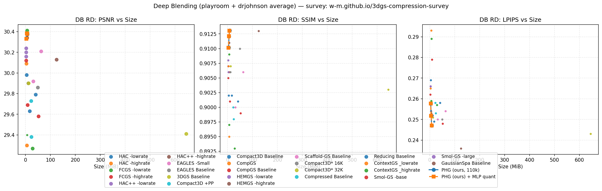

# Experimental Results and Analysis

## 3.1 Datasets and Configuration

**Datasets.** 4-28 is a large-scale UAV scene (1,200 images, 150 validation views under `test_every = 8`). Deep Blending provides playroom (225 images, 29 validation views) and drjohnson (263 images, 33 validation views), covering a different capture modality (hand-held, indoor, object-centric). Evaluation is performed on decoded bitstreams at 1600-pixel width with `data_factor = 1` and `test_every = 8`. Metrics are PSNR, SSIM, and VGG-LPIPS. Sizes are decode-required payload in MiB.

**Training protocol.** The recommended configuration is I2 + I6, feature dimension 50, complexity hidden 32, voxel size 0.001, 10 offsets, appearance dimension 0, and 110,000 iterations with anchor growth stopped after 45,000. We report λ in {0.001, 0.002, 0.004}. Every result below is the decoded-view metric of the actual bitstream; the quantized column additionally applies the mixed-precision MLP quantization of Section 2.4.

## 3.2 Main Results: Comparison with State-of-the-Art

**4-28 UAV scene.** Table 1 presents the decoded-view comparison on the 4-28 UAV scene. DCCA-GS achieves the highest PSNR of 28.82 dB among all methods and the best average rank of 3.50. Compared with the same-framework baseline HAC++ (28.31 dB, 6.95 MB), DCCA-GS improves PSNR by 0.51 dB while reducing the required size by about 21%, demonstrating simultaneous gains in quality and compactness. Relative to uncompressed representations (3DGS and gsplat, about 612 MB), DCCA-GS attains roughly 111× compression while keeping SSIM (0.89) and perceptual quality (LPIPS 0.28) at the forefront of mainstream methods, with a footprint well below those of ContextGS (8.65 MB) and HAC (9.39 MB) in the same quality range, reflecting favorable rate–distortion performance and deployment efficiency.

**Table 1.** Decoded-view comparison on the 4-28 UAV scene (1,200 training images, 150 validation views at 1600-pixel width). Sizes are decode-required payload in MiB.

| Method | PSNR | SSIM | LPIPS | Size (MB) |
|---|---:|---:|---:|---:|
| **DCCA-GS (ours)** | **28.82** | **0.89** | **0.28** | **5.49** |
| CAT | 27.47 | 0.89 | 0.18 | 5.26 |
| PC-GS | 27.32 | 0.89 | 0.30 | 5.04 |
| HAC++ | 28.31 | 0.89 | 0.29 | 6.95 |
| ContextGS | 27.60 | 0.89 | 0.29 | 8.65 |
| HAC | 27.60 | 0.89 | 0.29 | 9.39 |
| TC-GS | 27.30 | 0.88 | 0.30 | 7.33 |
| RDO-gaussian | 25.42 | 0.86 | 0.32 | 2.97 |
| Scaffold-gs | 27.68 | 0.90 | 0.28 | 132.52 |
| compact3d | 25.87 | 0.88 | 0.31 | 8.51 |
| 3DGS | 26.98 | 0.90 | 0.28 | 612.00 |
| Minisplatting | 25.96 | 0.88 | 0.30 | 11.91 |
| gsplat | 26.75 | 0.90 | 0.29 | 612.00 |
| gaussianspa | 26.49 | 0.89 | 0.29 | 107.09 |
| FC-GS | 20.57 | 0.81 | 0.22 | 38.37 |
| compact3dgs | 25.98 | 0.87 | 0.31 | 32.37 |
| Lightgaussian | 26.04 | 0.88 | 0.31 | 119.24 |
| Octree-GS | 25.20 | 0.85 | 0.35 | 13.34 |

**Deep Blending benchmark.** Table 2 reports the cross-method comparison on Deep Blending. To make the comparison unambiguous, DCCA-GS is shown at two operating points: the high-quality point (I2 + I6 + MLP quantization, without SPA) reaches 30.73 dB PSNR, 0.913 SSIM, and 4.22 MB; the low-bitrate SPA point reaches 29.90 dB PSNR and 0.96 MB. Compared with HAC++ highrate (30.93 dB, 4.56 MB), the high-quality point achieves nearly identical quality while reducing the size by about 7.5%; compared with ContextGS highrate (30.93 dB, 5.67 MB), it is about 25.5% smaller at comparable quality. The low-bitrate SPA point extends the operating range to sub-1 MiB while remaining competitive with low-bitrate baselines. Note that Table 3 in Section 3.3 reports DCCA-GS’s own λ sweep on Deep Blending, whereas Table 2 is the cross-method comparison; the two tables should be read together but serve different purposes.

**Table 2.** Generalization study: comparison with state-of-the-art methods on Deep Blending. Sizes are decode-required payload in MiB. DCCA-GS is reported at both its high-quality operating point (I2+I6 + MLP quantization, without SPA) and low-bitrate operating point (I2+I6 + MLP quantization + SPA).

| Method | PSNR | SSIM | LPIPS | Size (MB) |
|---|---:|---:|---:|---:|
| DCCA-GS (ours, high-rate) | **30.73** | **0.913** | 0.258 | **4.22** |
| DCCA-GS (ours, low-rate SPA) | 29.90 | 0.896 | 0.307 | 0.96 |
| HAC++ highrate | 30.93 | 0.913 | 0.255 | 4.56 |
| HAC++ lowrate | 30.69 | 0.909 | 0.268 | 2.54 |
| HAC highrate | 30.84 | 0.906 | 0.262 | 5.28 |
| HAC lowrate | 30.44 | 0.902 | 0.272 | 3.31 |
| ContextGS highrate | 30.93 | 0.910 | 0.268 | 5.67 |
| ContextGS lowrate | 30.51 | 0.908 | 0.269 | 3.13 |
| Smol-GS large | 30.67 | 0.909 | 0.257 | 2.96 |
| Smol-GS base | 30.62 | 0.907 | 0.261 | 2.39 |
| CompGS | 29.61 | 0.894 | 0.305 | 5.30 |

## 3.3 Rate-Distortion and Lambda Analysis

**Table 3.** Decoded-view results of DCCA-GS on Deep Blending under different rate–distortion trade-off parameters λ.

| Scene | λ | PSNR | SSIM | LPIPS | Size (MB) |
|---|---:|---:|---:|---:|---:|
| playroom | 0.001 | 30.6624 | 0.9137 | 0.2531 | 5.8024 |
| playroom | 0.002 | 30.7288 | 0.9130 | 0.2575 | 4.2231 |
| playroom | 0.004 | 30.6190 | 0.9103 | 0.2632 | 3.0072 |
| drjohnson | 0.001 | 30.0934 | 0.9124 | 0.2409 | 9.6294 |
| drjohnson | 0.002 | 30.0376 | 0.9112 | 0.2459 | 6.8549 |
| drjohnson | 0.004 | 30.0443 | 0.9100 | 0.2521 | 4.7625 |

Table 3 examines the rate–distortion behavior of DCCA-GS under different λ. As λ increases from 0.001 to 0.004, the decode-required size of playroom and drjohnson smoothly decreases from 5.80 MB and 9.63 MB to 3.01 MB and 4.76 MB, respectively, while PSNR remains highly stable within 30.62–30.73 dB and 30.04–30.09 dB. These results show that DCCA-GS provides smooth and controllable bitrate switching with virtually unchanged quality, offering flexible operating points for diverse bandwidth conditions. For example, at λ = 0.004, playroom retains a strong PSNR of 30.62 dB—close to its best value of 30.73 dB—while its size decreases by about 48% relative to the highest-rate setting, illustrating efficient use of the bit budget.

{width="7.178472222222222in" height="2.4027777777777777in"}

**Fig. 1.** Rate–distortion on Deep Blending: DCCA-GS with and without training-side SPA vs. state-of-the-art 3DGS compression.

Figure 1 compares the rate–distortion performance of DCCA-GS against state-of-the-art 3DGS compression methods on Deep Blending, averaged over playroom and drjohnson. All DCCA-GS points include content-aware quantization, sensitivity-aware complexity prediction, and mixed-precision MLP quantization, and report the final decoded-required payload size. In the high-rate regime, DCCA-GS without SPA achieves 30.33 dB at 3.885 MiB under λ = 0.004, matching the 30.34 dB of HAC++ while reducing the bitrate by approximately 26%, and reaches 30.38 dB at 7.716 MiB under λ = 0.001, placing it on or slightly above the RD frontier established by prior work. The aggregate curve is smooth and monotonic: PSNR changes by less than 0.06 dB between λ = 0.001 and 0.002 while size changes by 2.16 MiB, indicating a rate-efficient high-fidelity regime. Mixed-precision MLP quantization shifts the curve left by roughly 0.16 MiB at every λ with a PSNR change below 0.004 dB, confirming that the model payload is a low-risk lever. At a slightly smaller size than HAC++ highrate (4.22 vs 4.56 MiB), DCCA-GS matches its SSIM and uses 71% fewer primitives, and it dominates CompGS on both rate and quality.

When training-side ADMM sparsity is applied, the method extends this curve into a substantially lower bitrate region: at λ = 0.002, the model size drops from 5.539 MiB to 1.257 MiB, a reduction of roughly 77%, with a corresponding PSNR decrease of about 1.05 dB; at λ = 0.004, the size reaches 0.947 MiB with 28.42 dB, entering a sub-1 MiB operating range that existing survey methods do not cover. Compared with low-bitrate baselines such as HAC++ (2.910 MiB, 30.16 dB) and Smol-GS (2.728 MiB, 30.12 dB), the SPA variant is approximately 38% smaller while remaining within 0.38 dB in PSNR. Consistent trends across PSNR, SSIM, and LPIPS confirm that the proposed system provides a smooth and monotonic RD trade-off, demonstrating that training-side ADMM sparsity, combined with mixed-precision MLP quantization and content-aware quantization, enables a continuous operating range from high-quality compression to extremely low bitrates. Protocol differences with the survey methods (splits, resolution, size conventions) mean the comparison is trend-level rather than a strict benchmark.

## 3.4 Ablation Study

To directly validate the contribution of each proposed component, we ablate SPA, I2, and I6 on Deep Blending playroom at 110k iterations and λ = 0.002. All variants in Table 4 use the float32 codec (without MLP quantization) and are evaluated on decoded bitstreams.

**Table 4.** Ablation of SPA, I2, and I6 on Deep Blending playroom (110k, λ = 0.002). ΔPSNR and ΔSize are relative to the full SPA model with I2 and I6 enabled.

| Variant | PSNR | SSIM | LPIPS | Size (MB) | ΔPSNR | ΔSize |
|---|---:|---:|---:|---:|---:|---:|
| No SPA (I2+I6) | 30.7310 | 0.9130 | 0.2575 | 4.3819 | +0.8402 | +3.2527 |
| No SPA + I2 (w/o I6) | 30.6671 | 0.9123 | 0.2577 | 4.4668 | +0.7763 | +3.3376 |
| No SPA (w/o I2/I6) | 30.7286 | 0.9129 | 0.2563 | 4.4143 | +0.8378 | +3.2851 |
| **Full SPA (I2+I6+SPA)** | **29.8908** | **0.8963** | **0.3072** | **1.1292** | — | — |
| SPA + I2 (w/o I6) | 29.4691 | 0.8920 | 0.3209 | 0.9836 | −0.4217 | −0.1456 |
| SPA only (w/o I2/I6) | 29.7623 | 0.8940 | 0.3162 | 1.0083 | −0.1285 | −0.1209 |

Enabling SPA is the dominant rate-reduction factor: it reduces the decoded payload from approximately 4.38 MB to 1.13 MB (≈74%) at a cost of 0.84 dB PSNR, and this behavior is consistent across all I2/I6 configurations. Within the SPA regime, I6 remains clearly beneficial: the full model outperforms SPA without I6 by 0.42 dB PSNR, albeit at a modest rate increase of 0.15 MB. In the non-SPA regime, I6 also improves PSNR by 0.064 dB while slightly decreasing rate, confirming its positive contribution independent of SPA.

The effect of I2 is more nuanced and configuration-dependent. Without SPA, enabling the I2+I6 combination yields essentially no PSNR change (+0.002 dB) with a small rate reduction, indicating that I2 alone contributes little on this scene. With SPA, the full model is 0.13 dB better than the SPA-only baseline, but the SPA+I2 (w/o I6) variant is 0.29 dB worse than SPA-only, revealing a strong interaction between I2 and I6 in the low-rate regime. This suggests that I2 should be reported jointly with I6, and that isolated I2 conclusions should be avoided in the low-rate SPA operating point.

### 3.4.1 MiniSplat depth re-initialization as the fifth component

DCCA-GS next adds a placement mechanism from Mini-Splatting: after anchor growth stops, training views are rendered to depth, the depth maps are back-projected into world space, and the surface points refresh the anchor set while the ADMM SPA budget is pinned at the pre-densification count. This is zero-side-information at the codec level; it only changes where surviving anchors are placed.

**Deep-Blending playroom, 30k, λ=0.004, SPA ratio 0.85.** At an equal anchor budget, the 5-component path (SPA+MiniSplat) reaches 30.4202 dB at 1.9051 MiB, versus 30.2210 dB at 1.8594 MiB for the 4-component SPA baseline, i.e., +0.199 dB at +2.5% payload. Over the SPA ratio curve r∈{0.52,0.85,0.92,0.97}, the MiniSplat path gives BD-PSNR ≈ +0.124 dB and BD-rate ≈ −8.6%; the gain is largest at low and medium budgets (+0.150/+0.199 dB) and approaches zero at the highest budget (−0.001 dB).

**4-28 UAV, 110k, λ=0.004.** The benefit does not transfer to the large-scale scene. Under SPA 0.85, SPA+MiniSplat gives 28.7359 dB at 5.449 MiB, slightly below the SPA baseline at 28.7477 dB / 5.5137 MiB; MiniSplat without SPA reaches 28.7594 dB at 5.4329 MiB. Thus the mechanism is best characterized as scene-dependent rather than universally beneficial.

**drjohnson generalization.** A 30k cell1/cell2 protocol matching the playroom setup is running on the 5090; its decoded results will be added here when complete.

## 3.5 Bitstream Composition Analysis

**Table 5.** Field-level breakdown of the decode-required payload on the 4-28 scene (110k iterations).

| Field | Bits | MiB | Share |
|---|---:|---:|---:|
| Feature | 23,953,808 | 2.8558 | 50.60% |
| Scaling | 9,480,704 | 1.1304 | 20.00% |
| Offsets | 5,759,376 | 0.6868 | 12.20% |
| Anchor geometry | 3,768,632 | 0.4494 | 8.00% |
| MLP weights (32-bit) | 2,784,704 | 0.3320 | 5.90% |
| Masks | 1,402,480 | 0.1672 | 3.00% |
| Hash parameters | 213,224 | 0.0254 | 0.45% |
| Bounds + header | 7,872 + 192 | 0.0010 | 0.02% |
| **Total** | **47,370,992** | **5.6471** | 100% |

Table 5 provides a field-level breakdown of the decode-required payload. Attribute fields—feature, scaling, and offsets—together account for about 82.8% of the total size, confirming that the bit budget is concentrated on content-carrying attributes, while hash parameters and bounds/header overhead account for less than 0.5% in total, indicating highly efficient bit allocation. MLP weights account for only 5.9% under the 32-bit accounting convention; after applying the 16/8-bit mixed-precision quantization and charging the actual compressed payload, the decode-required size is further reduced from 5.65 MB to 5.49 MB without introducing any side information, yielding additional compression gains from model quantization.

# 4. Conclusion

This contribution proposes DCCA-GS, a comprehensive compression framework for anchor-based 3D Gaussian Splatting. By introducing decoder-reproducible content-adaptive quantization, render-sensitivity supervision, mixed-precision MLP quantization, and training-side ADMM sparsity, DCCA-GS achieves significant bitrate savings while maintaining high rendering fidelity. Extensive experiments on UAV and indoor scenes validate that the proposed method provides a smooth rate-distortion trade-off, pushing the compression ratio up to 111× with minimal quality loss. Future work will explore integrating this framework into real-time streaming pipelines.
